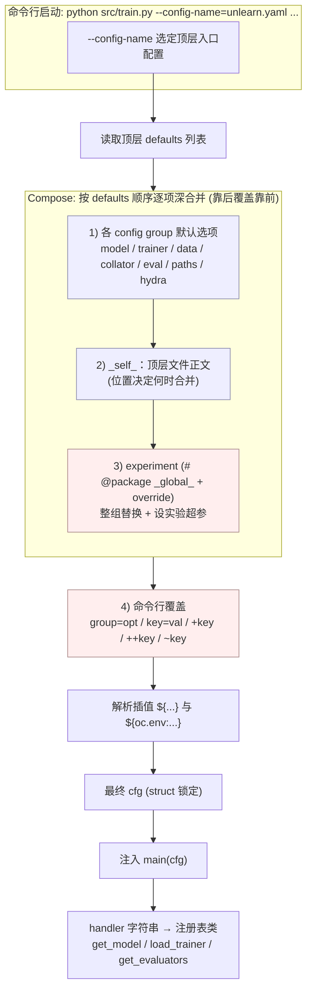

# Hydra 配置系统使用指南（中文）

本文档讲解 [Hydra](https://hydra.cc) 在本项目（OpenUnlearning / TOFU）中的用法：
配置文件语法、参数优先级、命令行调用方式，并配一张「优先级链 + 合成流程」图。

---

## 0. Hydra 在本项目的角色

入口 `src/train.py` / `src/eval.py` 都用 `@hydra.main(config_path="../configs", config_name=...)`
装饰。Hydra 启动时做三件事，把整棵配置树 `cfg` 注入 `main(cfg)`：

1. **Compose（组合）**：按 `defaults:` 列表把分散在 `configs/<组>/<名>.yaml` 的组件拼成一棵树；
2. **Override（覆盖）**：应用命令行参数；
3. **Interpolate（插值）**：解析 `${...}` 引用。

之后代码用「`handler` 字符串 → 注册表类」把配置变成对象
（`MODEL_REGISTRY` / `TRAINER_REGISTRY` / `EVALUATOR_REGISTRY` / `METRICS_REGISTRY`）。

---

## 1. 配置目录 = config groups（配置组）

`configs/` 下每个**子目录**是一个 **config group**，目录里每个 `.yaml` 是该组的一个**可选项**：

```
configs/
  train.yaml / unlearn.yaml / eval.yaml   # 顶层入口配置
  model/        # 组 "model"：Llama-3.2-1B-Instruct / Qwen2.5-7B-Instruct / ...
  trainer/      # 组 "trainer"：finetune / GradDiff / NPO / DPO / PDU / ...
  data/         # 组 "data"
  eval/         # 组 "eval"：tofu / muse / lm_eval
  collator/ paths/ hydra/ experiment/ ...
```

「选一个选项」= 命令行 `model=Llama-3.2-1B-Instruct`，或在 `defaults` 里写 `- model: Llama-3.2-1B-Instruct`。

---

## 2. `defaults:` 列表 —— 组合的核心

以 `configs/unlearn.yaml` 为例：

```yaml
defaults:
  - model: Llama-3.2-3B-Instruct   # 加载 configs/model/Llama-3.2-3B-Instruct.yaml -> cfg.model
  - trainer: GradAscent
  - data: unlearn
  - collator: DataCollatorForSupervisedDataset
  - eval: tofu
  - hydra: default
  - paths: default
  - experiment: null               # 占位：默认不选实验，可被命令行 experiment=... 填上
  - _self_                          # 本文件自身正文在合成顺序中的位置
```

要点：

- 每个 `- 组: 选项` 把对应 yaml 合并进 `cfg.<组>`。
- **`null`** = 该组默认不选。
- **`_self_`** = **本文件自身正文**（`defaults:` 以外的键）在合成顺序里的**插入点**。
- **合并是深合并（deep merge）**：后加载的配置只覆盖/新增重叠的叶子键，不会抹掉兄弟键。

### `_self_` 的位置很关键（项目里两种写法）

- `unlearn.yaml`：`_self_` 在**最后** → 本文件正文最后合并，能盖过前面所有组（含 experiment）。
- `train.yaml` / `eval.yaml`：`_self_` 在**最前** → 本文件正文先合并，会被后面的组覆盖。

> 规则：**defaults 从上到下依次合并，靠后覆盖靠前；`_self_` 表示"自己"在这条流水线里的插入点。**

---

## 3. `# @package` 指令 —— 决定"内容放到树的哪个位置"

写在文件**第一行**（不是注释）。默认按"被引入的路径"推导 package，`# @package` 显式指定目标。

### (a) `# @package _global_`（实验文件用）

`configs/experiment/unlearn/tofu/default.yaml`：

```yaml
# @package _global_
defaults:
  - override /model: Llama-3.2-1B-Instruct
forget_split: forget10        # 因为 _global_，落在 cfg 根，而非 cfg.experiment.*
```

`_global_` = 内容放到**配置树根**，所以实验文件能直接改 `cfg.model.*` / `cfg.trainer.*` / `cfg.forget_split`
—— 这就是 experiment 能当"整套实验清单"的原因。

### (b) `# @package eval.tofu.metrics.<名>`（指标文件用）

`configs/eval/tofu_metrics/forget_quality.yaml` 第一行是
`# @package eval.tofu.metrics.forget_quality`，把内容重定向到 `cfg.eval.tofu.metrics.forget_quality`，
对齐代码读取的 `eval.tofu.metrics`（`src/evals/base.py`）。这就是"在 defaults 里 import 一个指标名，
它的配置自动出现在 metrics 下"的原理。

### (c) defaults 里的 `@` —— 引入时重定位

`configs/eval/tofu_metrics/forget_Q_A_Prob.yaml`：

```yaml
defaults:
  - ../../data/datasets@datasets: TOFU_QA_forget          # 加载该数据集，放到本配置的 datasets 子键
  - ../../collator@collators: DataCollatorForSupervisedDatasetwithIndex
```

`组路径@目标package: 选项` = 加载某组选项并放到 `@` 后指定位置。`.@` 里的 `.` 表示**当前目录组**：

```yaml
# forget_quality.yaml：把当前目录(tofu_metrics)的 forget_Truth_Ratio 挂到 pre_compute 下
defaults:
  - .@pre_compute.forget_truth_ratio: forget_Truth_Ratio
```

命令行同样可用，例如换 forget 数据集：`data/datasets@data.forget=TOFU_QA_forget_idk`。

---

## 4. `- override /group: name`（实验文件里的覆盖）

在 experiment（`# @package _global_`）里改默认组选择，用 `override` + **绝对组路径**（前导 `/`）：

```yaml
defaults:
  - override /model: Llama-3.2-1B-Instruct
  - override /trainer: DPO
  - override /data/datasets@data.forget: TOFU_QA_forget_idk
```

- 不加 `override`：该组在顶层已选过 → 报重复错误；`override` 表示"来替换已有选择"。
- `/` 开头：从配置根算起的绝对组路径（实验文件在子目录，需绝对路径定位顶层组）。

---

## 5. 插值 `${...}`

```yaml
forget_split: forget10
eval:
  tofu:
    forget_split: ${forget_split}        # 引用同树别处的值，一处改处处变
```

`configs/paths/default.yaml` 用插值拼输出目录：
`output_dir: ${paths.root_dir}/saves/${mode}/${task_name}`。
也支持环境变量插值 `${oc.env:HF_HOME}` 等。

---

## 6. 参数优先级（从低到高）

最终值由下面这条链决定，**后者覆盖前者**：

1. **defaults 列表各组配置**，按列表顺序（靠后 > 靠前）；
2. **`_self_`**（顶层文件正文）在它所处位置参与合并；
3. **experiment**（`# @package _global_`，通常排在 defaults 靠后）→ 覆盖前面各组；
4. **命令行参数** → **最高优先级**。

> 因此 `experiment=unlearn/tofu/default` 里 trainer=GradAscent，命令行 `trainer=GradDiff` 仍会生效。

⚠️ 叠加 **struct 模式**：cfg 默认"结构冻结"，**覆盖不存在的键会报错**
（如 `Key 'holdout_split' is not in struct`）。新增键用 `+`（见下）；代码里改结构用 `with open_dict(...)`。

---

## 7. 命令行调用方式

| 写法 | 含义 | 例子 |
|------|------|------|
| `group=option` | **选**配置组选项 | `model=Llama-3.2-1B-Instruct`、`trainer=PDU` |
| `key=value` | 覆盖**已存在**的键 | `trainer.args.learning_rate=1e-5` |
| `+key=value` | **新增**配置里没有的键 | `+model.peft_args.r=16` |
| `++key=value` | 新增**或**强制覆盖 | `++trainer.args.num_train_epochs=3` |
| `~key` | **删除**某键 | `~trainer.args.logging_dir` |
| `group@pkg=option` | 选选项并重定位 package | `data/datasets@data.forget=TOFU_QA_forget_idk` |
| `--config-name=X` | 选顶层入口配置 | `--config-name=unlearn.yaml` |

调试 / 查看（建议先 dry-run 看合成结果，再真跑）：

```bash
python src/train.py ... --cfg job             # 打印 job 最终合成配置（不运行）
python src/train.py ... --cfg job --resolve   # 连 ${...} 插值也算出来
python src/train.py ... --cfg job --package trainer   # 只看 trainer 子树
python src/train.py ... --help                # 看可用组和选项
python src/train.py ... -m a=1,2 b=3,4        # multirun 扫参（笛卡尔积）
```

---

## 8. 端到端示例（DPO 命令）

```bash
python src/train.py --config-name=unlearn.yaml \
  experiment=unlearn/tofu/idk \
  model=Llama-3.2-1B-Instruct \
  trainer.args.eval_on_start=False \
  forget_split=forget10 retain_split=retain90 \
  task_name=demo_unlearn_DPO
```

合成顺序：

1. `--config-name=unlearn.yaml` → 顶层骨架（默认 model=3B、trainer=GradAscent、data=unlearn、eval=tofu…）；
2. `experiment=unlearn/tofu/idk` 填入 experiment 占位，其 `_global_`+`override` 把 trainer→DPO、
   data.forget→TOFU_QA_forget_idk，并设 forget/retain_split 等；
3. `_self_`（unlearn.yaml 正文）合并 `mode: unlearn` 等；
4. **命令行**最后覆盖：model→1B、eval_on_start=False、splits、task_name。

结果：DPO trainer + idk 数据 + 1B 模型，输出到 `saves/unlearn/demo_unlearn_DPO/`。

---

## 9. 「优先级链 + 合成流程」图



**优先级一句话**：`各组默认 < _self_ < experiment < 命令行`，最后再做 `${...}` 插值，得到冻结的 `cfg`。

---

## 10. 常见报错速查

| 报错 | 原因 | 解决 |
|------|------|------|
| `Key 'X' is not in struct` | 覆盖了配置里不存在的键（struct 锁） | 用 `+X=...` 新增；或确认该实验是否定义了 X |
| `Could not override 'group'` / `Could not find 'group/opt'` | 选了不存在的组选项 | 检查 `configs/<组>/` 下有无该 yaml；用 `--help` 看可选项 |
| `Could not append to ...` | 用 `key=` 改不存在的键 | 改用 `+key=` |
| 多个 default 冲突 / 重复 | 同组被选两次未用 override | 实验里用 `- override /group: ...` |

更多 Hydra 官方文档见：<https://hydra.cc/docs/intro/>
